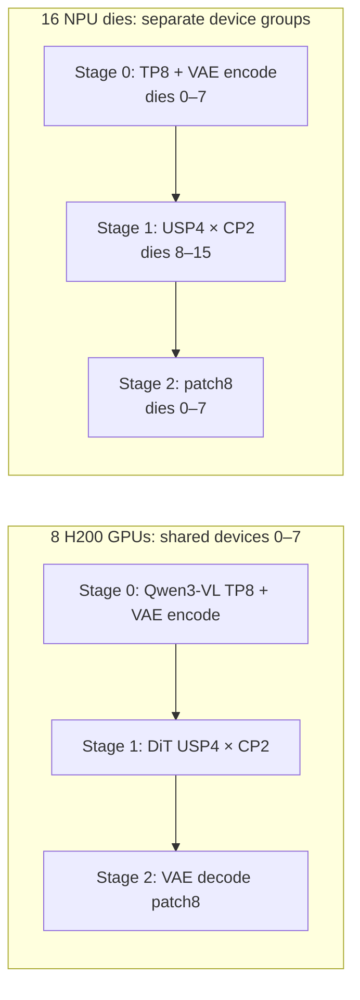

# MiniMax-H3 Ref2VA: separated encoders and VAE, DiT USP4 + CP2

This recipe is a deployment preflight for the 8-card/16-die MiniMax-H3 work.
It builds on the independent VAE decoder pipeline in this branch. Use a
complete **Ref2VA** checkpoint, not the repository root with an incomplete
partition. Both YAML files inherit
[`minimax_h3_disaggregated_decode.yaml`](../../../vllm_omni/deploy/minimax_h3_disaggregated_decode.yaml).

| Issue | Stage | Parallelism | What this layout checks |
| --- | --- | --- | --- |
| 1: DiT has 56 Q heads | 1: DiT only | Ulysses 4 × Ring/CP 2 = 8 ranks | 56 heads divide across Ulysses 4; Ring partitions sequence, not heads. |
| 2: Qwen3-VL has 8 KV heads | 0: Qwen3-VL + video/audio VAE encoders | TP8 | Encoder does not join DiT's process group. DP2 × TP8 is a separate alternative and is not part of this recipe. |
| 3: VAE tile/patch parallelism is limited to eight ranks | 2: independent video/audio VAE decoder | patch8 | Decoder does not join DiT's process group. This does not raise VAE's patch-parallel limit. |

The stages exchange payloads through `SharedMemoryConnector` on **one host**.
This is a deployment split, not a 16-rank DiT: stage 1 always uses eight ranks.
The 8-GPU preflight shares devices 0–7 among all three stage processes. The
16-die layout puts stage 0 and stage 2 on logical dies 0–7, and stage 1 on
dies 8–15. Check the runtime's logical-die numbering before applying it on a
target server. If the target is two hosts rather than one 16-die host, use the
existing [two-node recipe](../h3-a100-two-node/README.md) as the transport
starting point; `SharedMemoryConnector` cannot cross hosts.



## Preflight

Use this branch's vLLM-Omni source with a matching vLLM 0.30 environment on
every stage. The independent decoder implementation is on the experimental
branch used by this recipe; do not assume upstream `main` has it. Before
starting, verify the exact code revision, complete `Ref2VA/model_index.json`,
visible devices, available host RAM, and free accelerator memory. The
USP4+CP2+DLO measurements previously reported about 1100 GB of host-memory
use on the target configuration; treat that as a capacity preflight, not a
prediction for the H200 run.

`launch.sh` starts one stage per invocation. Set `PYTHON_BIN` if `python` is
not the matching environment's interpreter. The script does not install
packages, change the model, or start Mooncake. All three processes must see
the same source checkout and checkpoint, and all logical device IDs named in
the selected YAML.

## 8-GPU H200 smoke test

On the shared GPU host, obtain one **8-card** allocation for the entire
three-stage run. Do not start three independent `gpu run --gpus 8` jobs. From a
checkout of this branch on the GPU host:

```bash
export REPO=/data/dxw/code/h3-usp4-cp2-preflight
export MODEL=/data/models/hub/models--MiniMaxAI--MiniMax-H3/snapshots/428986c4aa5280855b9ac26eff8d1a46b5999cd0/Ref2VA
export REF_IMAGE=/data/dxw/outputs/h3-usp4-cp2/reference.png
export RUN_DIR=/data/dxw/outputs/h3-usp4-cp2/8gpu-smoke-01
export PYTHON_BIN=/data/dxw/env/h3-dlo-v030-main-pr7581-8084-20260924/bin/python

gpu status --no-schedule
PYTHON_BIN="$PYTHON_BIN" \
  bash "$REPO/recipes/MiniMaxAI/h3-usp4-cp2/submit_8gpu.sh" \
  "$MODEL" "$REF_IMAGE" "$RUN_DIR"
cat "$RUN_DIR/queue.log"  # Queue and run progress.
```

The smoke script launches stages 0, 1, and 2 within the one allocation,
waits for `/health`, sends a 512×512 Ref2VA request with two inference steps,
checks the MP4 with `ffprobe`, and stops its own stage processes. It keeps
the rendered logs, request metrics, source revision, and GPU snapshots in
`RUN_DIR`. A passing request shows that the separated pipeline and hybrid
DiT path run on eight H200 GPUs; it says nothing about 16-die NPU memory or
NPU Ring kernels.

## Single-host 16-die deployment

Use [`16die-local.yaml`](16die-local.yaml) when one host exposes logical dies
0–15 to each stage process. In three terminals on that host/container, set
the same `REPO`, `MODEL`, and `PYTHON_BIN` and start:

```bash
# Terminal 1: API, Qwen3-VL TP8, VAE encoders on dies 0–7.
bash "$REPO/recipes/MiniMaxAI/h3-usp4-cp2/launch.sh" 16die 0 "$MODEL" \
  2>&1 | tee "$RUN_DIR/stage0.log"

# Terminal 2: DiT USP4 + CP2 on dies 8–15.
bash "$REPO/recipes/MiniMaxAI/h3-usp4-cp2/launch.sh" 16die 1 "$MODEL" \
  2>&1 | tee "$RUN_DIR/stage1.log"

# Terminal 3: independent video VAE patch8 and audio decoder on dies 0–7.
bash "$REPO/recipes/MiniMaxAI/h3-usp4-cp2/launch.sh" 16die 2 "$MODEL" \
  2>&1 | tee "$RUN_DIR/stage2.log"
```

Create `RUN_DIR` beforehand. The API listens on port 18091; the Omni Master
uses 36000. Override `H3_API_PORT` and `OMNI_MASTER_PORT` on **all** processes
if those ports are occupied. Once `/health` responds, send the same request
used by `smoke_8gpu.sh` (substitute the reachable API address and a PNG path
visible to the API process). Start with two inference steps; only after a
valid video and audio response should a 50-step request be considered.

Check the stage logs and resolved topology: stage 0 TP8, stage 1
`ulysses_degree=4` and `ring_degree=2` with no VAE decoder, stage 2 VAE
patch8. Record per-die peak memory and host RAM as well as the MP4's streams.
GPU preflight cannot establish that NPU Ring attention or the 32 GB/die
placement works; classify any target failure by stage and first failing
operation before changing the YAML.
